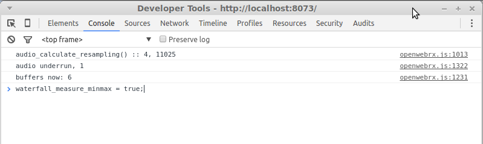
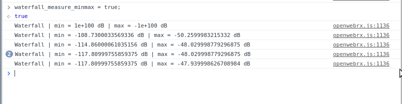

In `config_webrx.py`, there are settings related to the waterfall diagram.
```python
waterfall_min_level = -115 #in dB
waterfall_max_level = 0
```
Now if we see that the colors are incorrectly displayed, how do we find out the correct levels to set without trial and error?

While running OpenWebRX in Google Chrome, open the *Developer Tools* with `Ctrl + Alt + J`.

Enter the following line into the Console:

```javascript
waterfall_measure_minmax = true;
```


Then wait for the messages to appear, something like:  

    Waterfall | min = -102.54000091552734 dB | max = -50.209999084472656 dB

It will show the highest and the lowest peak detected in the spectrum, from the beginning.

These may give a clue about the values to set in order to see the whole range of colors on the waterfall diagram.



> **Note:** if there are no strong signals in the spectrum while doing this measurement, the max. level will not be correct. It is advised to set it around 0 dB, anyway.

