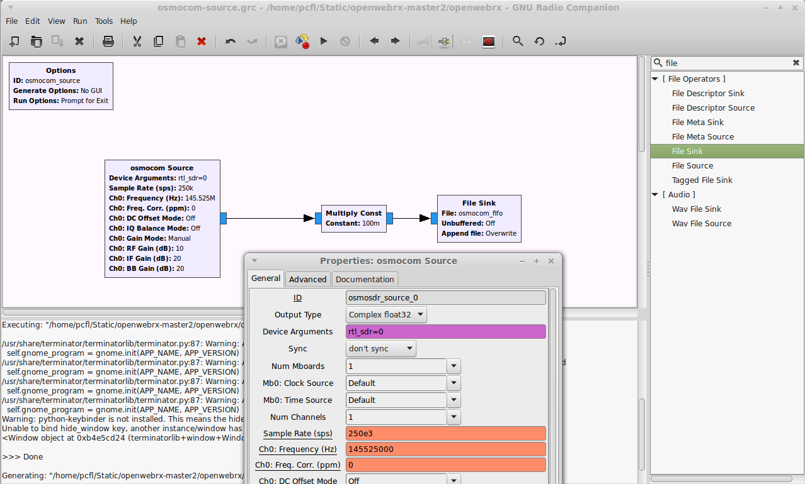

<a href="http://sdr.osmocom.org/trac/wiki/GrOsmoSDR">GrOsmoSDR</a> is a GNU Radio block, which allows you to use variety of SDR hardware with OpenWebRX, including:

* FunCube Dongle
* bladeRF
* ​HackRF
* USRP
* ​Fairwaves UmTRX
* RFSPACE ​SDR-IQ, ​SDR-IP, ​NetSDR 
* RTL-SDR, RTL-TCP
* MSi2500 based DVB-T dongles 
* ​SDRplay RSP
* ​AirSpy 

**Step #1:** You will need to install GNU Radio and GrOsmoSDR:

    sudo apt-get install gnuradio gr-osmosdr

Make sure you have at least GNU Radio version 3.7.8.1.

**Step #2:** Download [osmocom_source.grc](https://gist.githubusercontent.com/ha7ilm/19d14e1394bd2e7015e6/raw/141720f8b2b6da725fbcfc8959ee4ea4547b53a8/osmocom_source.grc) to the OpenWebRX directory.

    cd openwebrx
    wget https://gist.githubusercontent.com/ha7ilm/19d14e1394bd2e7015e6/raw/141720f8b2b6da725fbcfc8959ee4ea4547b53a8/osmocom_source.grc

**Step #3:** Execute the following:

    mkfifo /tmp/osmocom_fifo

**Step #4:** Open [osmocom_source.grc](https://gist.githubusercontent.com/ha7ilm/19d14e1394bd2e7015e6/raw/141720f8b2b6da725fbcfc8959ee4ea4547b53a8/osmocom_source.grc) in GNU Radio Companion. 

You can run GNU Radio Companion by:

    gnuradio-companion

...then select `File > Open` and look for the `osmocom_source.grc`.

Double-click the **osmocom Source** block, and configure the receiver.

Maybe *Device Arguments* is the most important field, which allows you to select the receiver, e.g. `rtl=0` or `hackrf=0` are valid choices among others (detailed on the *Documentation* tab).

**Step #5:** Apply the same configuration to `config_webrx.py`. You will have to set at least the following settings:
* `center_freq`
* `samp_rate`

You will also have to uncomment the two relevant lines (and comment out the ones for RTL-SDR):

    # >> gr-osmosdr signal source using GNU Radio (...)
    start_rtl_command="cat /tmp/osmocom_fifo"
    format_conversion=""

**Step #6:** Execute the flowgraph in GNU Radio Companion (F6 or `Run > Execute`). This will supply the I/Q data for OpenWebRX.

> Note: next time you can just run `python osmocom_source.py` from the command-line.

**Step #7:** While the flowgraph in GNU Radio Companion is running (in the background), start OpenWebRX:

    python openwebrx.py

 

