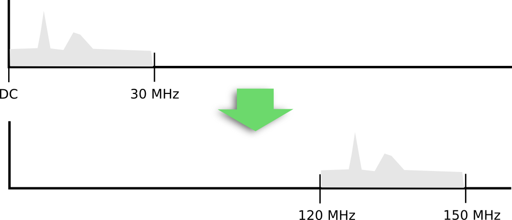

Your upconverter adds a frequency offset to any signal.



That's why we have to correct the frequency scale to show the original frequency of the signal.

You will have to alter the following two values in `config_webrx.py`:

* `center_freq`
* `shown_center_freq`

For example, if you want to show 1 MHz on the waterfall, from 14 MHz to 15 MHz (with the center of 14.5 MHz), and you have an upconverter with a 120 MHz crystal, with which you will receive this range between 134 MHz and 135 MHz (with the center of 134.5 MHz) you should use the following settings:

```python
samp_rate = 1024000
center_freq = 134500000 # = 14500000+120000000, this is where the center of the desired range is after upconversion
show_center_freq = 14500000 # this is what will be the center of the scale on the UI
```

Another way to configure this is to give the 120 MHz frequency offset the following way:
```python
samp_rate = 1024000
center_freq = 134500000
show_center_freq = center_freq - 120000000
```
